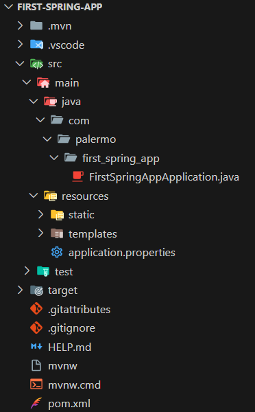

# Introdução ao Spring Boot Framework

## Spring
O **Spring** é um framework open-source para a linguagem Java (mas também suporta Groovy e Kotlin) que facilita o desenvolvimento de aplicações robustas, escaláveis e de fácil manutenção. Ele oferece:
- **Inversão de Controle (IoC):** O Spring gerencia os objetos (beans) e suas dependências automaticamente. Exemplo: você não precisa criar instâncias manualmente; usa @Autowired e o Spring injeta o bean.
- **Programação Orientada a Aspectos (AOP)**: Permite separar preocupações transversais, como logs, segurança ou transações, sem misturar no código principal.
- **Integração com bancos de dados**
    - Spring Data simplifica o acesso a bancos relacionais e NoSQL.
    - Suporte a JPA, JDBC, MongoDB, Redis e outros.
- **Gestão de transações**
    - Controle declarativo de transações com @Transactional.
- **Segurança**
    - Spring Security fornece autenticação, autorização e proteção contra ataques comuns.
- **Programação reativa**
    - Spring WebFlux permite criar aplicações não bloqueantes e altamente escaláveis.
- **Suporte a Web Services**
    - Criação de APIs REST (Spring MVC) ou SOAP.
    - Serialização/deserialização de JSON ou XML.
    -  Servidor Tomcat embutido.
- **Integração com filas e mensageria**
    - Spring AMQP (RabbitMQ), Kafka, JMS.
- **Batch Processing**
    - Spring Batch para processamento em massa de dados com controle de transações e retry.
- **Cloud e microsserviços**
    - Spring Cloud ajuda a criar microsserviços com descoberta, configuração centralizada, circuit breaker, etc.

## Spring Boot
O Spring Boot é um framework que simplifica a criação e a configuração de aplicações Java baseadas no Spring Framework. O Spring Boot usa o classpath para gerenciar dependências e configurações automaticamente, evitando que você configure manualmente servidores, bibliotecas e recursos. Possui dependências "starter", que são conjuntos de bibliotecas pré-configuradas para funcionalidades comuns.
Por exemplo:
- `spring-boot-starter-web`: traz tudo para criar APIs REST.
- `spring-boot-starter-data`-jpa: traz tudo para trabalhar com banco de dados usando JPA.
- `spring-boot-starter-security`	: Adiciona Spring Security para autenticação e autorização.
- `spring-boot-starter-thymeleaf`: Criação de páginas web usando o template engine Thymeleaf.
- `spring-boot-starter-test`: Ferramentas para testes (JUnit, Mockito, Spring Test).
- `spring-boot-starter-actuator`: Monitoração da aplicação (health, métricas, endpoints administrativos).
- `spring-boot-starter-mail`: Envio de emails via JavaMail.
- `spring-boot-starter-batch`: Processamento em massa de dados (Spring Batch).
- `spring-boot-starter-amqp`: Integração com filas de mensagens (RabbitMQ).
- `spring-boot-starter-webflux`: Criação de APIs reativas (não bloqueantes) usando Spring WebFlux.
- `spring-boot-starter-cache`: Suporte a cache com abstração Spring Cache.
- `spring-boot-starter-oauth2-client`: Conexão com provedores OAuth2, login social, SSO.

## Spring Initializr
O Spring Initializr é uma ferramenta web que permite a criação aplicações/projetos que utilizem o Spring Boot de forma rápida. Permite escolher a linguagem (Java, Kotlin, Groovy), versão do Spring Boot, dependências, nome do projeto, tipo de build (Maven/Gradle) etc. <br />
Link para acessar a ferramenta: https://start.spring.io/.

## Configurações do projeto no Spring Initializr


Para um exemplo de projeto web, seguem as configurações do projeto:

### Gestores de dependências
- Gradle - Groovy
- Gradle - Kotlin
- **Maven**
### Linguagens
- **Java**
- Kotlin
- Groovy
### Versões
- 3.4.0 (SNAPSHOT)
- 3.4.0 (M1) -> Milestone Release
- 3.3.3 (SNAPSHOT)
- **3.3.2 (versão estável)**
- 3.2.9 (SNAPSHOT)
- 3.2.8

### Metadados do Projeto
- `Group`: Domínio invertido que identifica o autor/empresa (com.palermo)
- `Artifact`: Nome do artefato gerado (first-spring-app)
- `Name`: Nome legível do projeto (First Spring App)
- `Description`: Breve descrição da aplicação (Uma aplicação simples criada para estudar o ecossistema Spring Boot.)
- `Package name`: Pacote base onde o código fonte será criado (com.palermo.firstspringapp)
- `Packing`: O nome do pacote base para o código fonte, geralmente é group + artifact`. Exemplo`: com.meuapp.lojavirtual
    - `Jar (Java ARchive)`: Gera um arquivo .jar executável. Mais usado em aplicações Spring Boot (rodam standalone com java -jar)
    - `War (Web Aplication Archive)`: Usado para rodar dentro de um servidor de aplicação (Tomcat, JBoss, WildFly). Menos comum, já que o Spring tem embutido o TomCat.
- `Java`:
    - 25
    - 21
    - 17
> Neste caso, foi escolhida a versão 21 do Java, visto que era a versão mais recente suportável pelo framework.

### Dependências
Quanto às dependências do projeto, serão utilizadas:
- Spring Boot DevTools
    - Facilita o desenvolvimento com recursos que tornam o ciclo de teste mais rápido.
    - Refresh
        - Detecta alterações no código e atualiza o contexto da aplicação.
    - Restart
        - Reinicia a aplicação automaticamente quando há mudanças no código, sem precisar parar manualmente o servidor.
    - LiveReload
        - Atualiza automaticamente o navegador quando arquivos estáticos ou templates mudam.
- Spring Web
    - Adiciona suporte para desenvolvimento de APIs REST e aplicações web, incluindo:
    - @RestController, @RequestMapping, @GetMapping, @PostMapping etc.
    - Servidor embutido (Tomcat) para rodar a aplicação standalone.
- Lombok
    - Biblioteca que reduz código boilerplate em Java. Facilita a criação de classes com menos esforço, fornecendo:
    - @Getter e @Setter: gera automaticamente os métodos getters e setters.
    - @AllArgsConstructor: cria construtor com todos os atributos da classe.
    - @NoArgsConstructor: cria construtor sem parâmetros.

Após definir as configurações, faça o download do arquivo .zip do projeto clicando no botão `Generate`.

## Estrutura do projeto



```bash
first-spring-app/
    ├── src/ # pasta raiz do código fonte e testes
    │   ├── main/ # código principal da aplicação
    │   │   ├── java/ # código Java
    │   │   │   └── com/ # pacote base da aplicação.
    │   │   │       └── palermo/ 
    │   │   │           └── firstspringapp/ 
    │   │   │               └── FirstSpringAppApplication.java # classe principal, onde fica o @SpringBootApplication que inicia a aplicação.
    │   │   └── resources/ # arquivos de configuração e recursos
    │   │   ├── static/ # arquivos estáticos (CSS, JS, imagens).
    │   │   ├── templates/ # arquivos de templates (Thymeleaf, JSP, etc.).
    │   │       └── application.properties # arquivo de configuração da aplicação (porta, banco de dados, etc.).

    │   └── test/ # código para testes automatizados
    │       └── java/ # testes em Java
    ├── pom.xml # arquivo de gerenciamento de dependências e build do Maven
```

## Exibir "Hello World"
Para este primeiro exemplo: exibir "Hello World" no navegador. Para isso, na pasta fisrt_spring_app, crie o arquivo `controller/HelloWorldController.java` e cole o seguinte conteúdo:

```java
package com.palermo.first_spring_app.controller;


import org.springframework.web.bind.annotation.GetMapping;
import org.springframework.web.bind.annotation.RequestMapping;
import org.springframework.web.bind.annotation.RestController;


@RestController // indica que a classe é um controller Rest
@RequestMapping("/hello-world") // mapeia uma URL para a classe ou método
public class HelloWorldController {
    @GetMapping // mapeia requisições HTTP GET para um método
    // @GetMapping("/get")
    public String helloWorld() {
        return "<h1>Hello World</h1>";
    }
}
```

## Java Já instalado
Caso já tenha uma versão do Java instalado e não queira desinstala-lá, apenas mude a versão antes de iniciar o servidor:

Linux/Mac
```bash
export JAVA_HOME=/usr/lib/jvm/jdk-21
export PATH=$JAVA_HOME/bin:$PATH
```

Windows
```cmd
set JAVA_HOME=C:\Program Files\Java\jdk-21
set PATH=%JAVA_HOME%\bin;%PATH%
```

Garanta também que no pom.xml esteja a versão escolhida. Neste caso, a versão 21:
```xml
<properties>
    <java.version>21</java.version>
</properties>
```

Para iniciar a aplicação, execute:

Linux/Mac
```
./mvnw spring-boot:run
```

Windows
```
mvnw.cmd spring-boot:run # Windows
```

O servidor estará disponível em [http://localhost:8080/hello-world](http://localhost:8080/hello-world).


Isso exibirá "Hello World" com a formatação de título do HTML.


## Service e Controller

Antes, toda a lógica da aplicação estava sendo tratada diretamente dentro do controller, o que tornava o código menos organizado e mais difícil de manter. Caso o comportamento precisasse mudar, seria necessário alterar o controller, que deveria apenas lidar com as requisições HTTP.

Para resolver isso, iremos transferir a responsabilidade da lógica para o service, deixando o controller apenas como intermediário. Assim, o controller cuida do fluxo das requisições e o service concentra a lógica de negócio, tornando o código mais limpo, reutilizável e fácil de testar.

Na pasta da aplicação, crie `services/HelloWorldService.java`:
```java
package com.palermo.first_spring_app.service;


import org.springframework.stereotype.Service;


@Service // define uma classe de serviço gerenciada pelo Spring
public class HelloWorldService {   
    public String helloWorld() {
        return "<h1>Hello World</h1>";
    }
}
```

E no `HelloWorldController.java`:
```java
package com.palermo.first_spring_app.controller;


import org.springframework.web.bind.annotation.GetMapping;
import org.springframework.web.bind.annotation.RequestMapping;
import org.springframework.web.bind.annotation.RestController;


@RestController // indica que a classe é um controller Rest
@RequestMapping("/hello-world") // mapeia uma URL para a classe ou método
public class HelloWorldController {


    @Autowired // faz a injeção de dependência (new HelloWorldService())
    private HelloWorldService helloWorldService;


    @GetMapping
    // @GetMapping("/get")
    public String helloWorld() {
        return helloWorldService.helloWorld();
    }
}
```

Podemos passar valores, como um nome, por exemplo, alterando as linhas:

`HelloWorldService.java`:
```java
public String helloWorld(String name) {
    return String.format("<h1>Hello World %s</h1>", name);
}
```

`HelloWorldController.java`:
```java
public String helloWorld() {
    return helloWorldService.helloWorld("Hick");
}
```

Indo para o navegador, veremos: <br />


Agora, exibe "Hello World" mais o nome que passamos. Neste caso, "Hick".

## Criação de uma API simples

### Dados da API
Vamos criar uma API simples para gerenciar usuários, com os seguintes métodos:

| Método HTTP + Endpoint | Objetivo | Entrada | Saída |
|------------------------|-----------|----------|--------|
| **GET /users/** | Listar os usuários | Nenhuma | <pre><code>{<br>  "nome": "nome",<br>  "email": "email"<br>}</code></pre> |
| **POST /users/** | Criar um usuário | <pre><code>{<br>  "nome": "nome",<br>  "email": "email"<br>}</code></pre> | <pre><code>{<br>  "nome": "nome",<br>  "email": "email"<br>}</code></pre> |
| **GET /users/{id}/** | Obter dados de um usuário | Nenhuma | <pre><code>{<br>  "nome": "nome_ID",<br>  "email": "email_ID"<br>}</code></pre> |
| **PUT /users/{id}/** | Editar dados de um usuário | <pre><code>{<br>  "nome": "nome_ID",<br>  "email": "email_ID"<br>}</code></pre> | <pre><code>{<br>  "nome": "nome_ID",<br>  "email": "email_ID"<br>}</code></pre> |
| **DELETE /users/{id}/** | Excluir dados de um usuário | Nenhuma | <pre><code>{<br>  "nome": "nome_ID",<br>  "email": "email_ID"<br>}</code></pre> |

## Arquivos necessários e suas funções
| Arquivo  | Objetivo |
| -- | -- |
| db/UserBancoDeDados.java | Simula o banco de dados da aplicação. Armazena uma lista de usuários em memória (sem usar banco real). Contêm os métodos para adicionar, listar e remover usuários.
| domain/User.java | Representa o modelo (ou entidade) do usuário. Define os atributos que um usuário possui, como name e email. É a classe que descreve os dados manipulados pelo sistema. |
| controller/UserController.java | Define os endpoints da API (rotas HTTP). Recebe as requisições (como /users), chama os métodos do UserService, e devolve as respostas para o cliente (geralmente em JSON). |
| service/UserService.java | Contém a lógica de negócio. É responsável por acessar o "banco" (UserBancoDeDados) e realizar operações, como buscar, cadastrar ou remover usuários. O controller usa essa classe para executar as ações. |

db/UserBancoDeDados.java
```java
package com.palermo.first_spring_app.db;

import java.util.ArrayList;
import java.util.List;
import com.palermo.first_spring_app.domain.User;


public class UserBancoDeDados {


    private List<User> usuarios;


    public UserBancoDeDados() {
        this.usuarios = new ArrayList<>();
    }


    public void adicionarUsuario(User user) {
        usuarios.add(user);
    }


    public List<User> listarUsuarios() {
        return usuarios;
    }


    public User obterUsuario(int id) {
        if (id < 0 || id >= usuarios.size()) {
            return null;
        }
        return usuarios.get(id);
    }


    public User atualizarUsuario(int id, User user) {
        if (id < 0 || id >= usuarios.size()) {
            return null;
        }
        usuarios.set(id, user);
        return usuarios.get(id);
    }


    public User removerUsuario(int id) {
        if (id < 0 || id >= usuarios.size()) {
            return null;
        }
        return usuarios.remove(id);
    }  
}
```

domain/User.java
```java
package com.palermo.first_spring_app.domain;

import lombok.AllArgsConstructor;
import lombok.Getter;
import lombok.Setter;


@Getter // gera automaticamente os métodos getters
@Setter // gera automaticamente os métodos setters
@AllArgsConstructor // gera automaticamente o construtor
public class User {
    private String nome;
    private String email;
}
```

controller/UserController.java
```java
package com.palermo.first_spring_app.controller;


import org.springframework.beans.factory.annotation.Autowired;
import org.springframework.web.bind.annotation.DeleteMapping;
import org.springframework.web.bind.annotation.GetMapping;
import org.springframework.web.bind.annotation.PathVariable;
import org.springframework.web.bind.annotation.PostMapping;
import org.springframework.web.bind.annotation.PutMapping;
import org.springframework.web.bind.annotation.RequestBody;
import org.springframework.web.bind.annotation.RequestMapping;
import org.springframework.web.bind.annotation.RestController;


import com.palermo.first_spring_app.domain.User;
import com.palermo.first_spring_app.service.UserService;


import java.util.List;


@RestController
@RequestMapping("/users/")
public class UserController {


    @Autowired
    private UserService userService;


    @GetMapping
    public List<User> listarUsuarios() {
        return userService.listarUsuarios();
    }


    @GetMapping("/{id}")
    public User obterUsuario(@PathVariable int id) {
        return userService.obterUsuario(id);
    }


    @PostMapping
    public void adicionarUsuario(@RequestBody User user) {
        userService.adicionarUsuario(user);
    }


    @PutMapping("/{id}")
    public User atualizarUsuario(
        @PathVariable("id") int id,
        @RequestBody User user
    ) {
        return userService.atualizarUsuario(id, user);
    }


    @DeleteMapping("/{id}")
    public User removerUsuario(@PathVariable("id") int id) {
        return userService.removerUsuario(id);
    }
}
```

service/UserService.java
```java
package com.palermo.first_spring_app.service;


import org.springframework.stereotype.Service;
import com.palermo.first_spring_app.db.UserBancoDeDados;
import com.palermo.first_spring_app.domain.User;
import java.util.List;


@Service
public class UserService {


    private final UserBancoDeDados userBanco;


    public UserService() {
        this.userBanco = new UserBancoDeDados();
        // adiciona alguns usuários iniciais só pra testar
        userBanco.adicionarUsuario(new User("Henrique", "henrique@gmail.com"));
        userBanco.adicionarUsuario(new User("Palermo", "palermo@gmail.com"));
    }


    public List<User> listarUsuarios() {
        return userBanco.listarUsuarios();
    }


    public void adicionarUsuario(User user) {
        userBanco.adicionarUsuario(user);
    }


    public User obterUsuario(int id) {
        return userBanco.obterUsuario(id);
    }
   
    public User atualizarUsuario(int id, User user) {
        return userBanco.atualizarUsuario(id, user);
    }


    public User removerUsuario(int id) {
        return userBanco.removerUsuario(id);
    }    
}
```

## Testando a API
Para testar os endpoints da sua API Spring Boot, você pode usar ferramentas como:
- [Postman](https://www.postman.com/): Aplicativo desktop popular para testes de APIs REST.
- [Insomnia](https://insomnia.rest/download): Alternativa leve e prática, também desktop.
- [ReqBin](https://reqbin.com/): Ferramenta online, não precisa instalar nada, acessível pelo navegador.

## Classes de configuração
No Spring, pode haver situações em que precisamos criar nossas próprias classes, mas utilizar a gerência do spring. Mas para isso, precisamos fazer com que o spring entendesse isso. Para este problema, temos as anotações `@Configuration` e `@Beans`.

Assim, o Spring será capaz de realizar a injeção das dependências corretamente.
Um exemplo dessa situação: uma biblioteca para fazer uma saudação ao usuário.

Arquivos:
- service/MinhaBiblioteca.java
- configuration/AppConfig.java
- controller/HelloController.java

service/MinhaBiblioteca.java:
```java
package com.palermo.first_spring_app.service;

public class MinhaBiblioteca {
    public String saudacao(String nome) {
        return "Olá, " + nome + "!";
    }
}
```

configuration/AppConfig.java:
```java
package com.palermo.first_spring_app.configuration;


import com.palermo.first_spring_app.service.MinhaBiblioteca;
import org.springframework.context.annotation.Bean;
import org.springframework.context.annotation.Configuration;


@Configuration
public class AppConfig {


    @Bean
    public MinhaBiblioteca minhaBiblioteca() {
        return new MinhaBiblioteca(); // Spring vai gerenciar este objeto
    }
}
```

controller/HelloController.java:
```java
package com.palermo.first_spring_app.controller;

import com.palermo.first_spring_app.service.MinhaBiblioteca;
import org.springframework.beans.factory.annotation.Autowired;
import org.springframework.web.bind.annotation.GetMapping;
import org.springframework.web.bind.annotation.RestController;


@RestController
public class HelloController {


    @Autowired
    private MinhaBiblioteca biblioteca;


    @GetMapping("/saudacao")
    public String saudacao() {
        return biblioteca.saudacao("Henrique");
    }
}
```

Por padrão, todos os componentes do Spring compartilham a mesma instância (padrão de projeto Singleton) do Bean. Isso significa que, sempre que o Bean for injetado em diferentes partes da aplicação, o Spring reutilizará a mesma instância, garantindo eficiência e consistência.

## Flexibilidade no App com Perfis (Profiles)
O Spring Boot permite configurar diferentes perfis de execução, tornando a aplicação mais flexível e adaptável a diferentes ambientes — como desenvolvimento, testes e produção.

Estes perfis permitem definir configurações específicas (como porta, banco de dados ou logs) sem precisar alterar o código principal.

Exemplo de Estrutura de Arquivos:
```
resources/
 ├── application.properties
 ├── application-dev.properties
 ├── application-prod.properties
```

application.properties:
```properties
spring.profiles.active=${ATCIVE_PROFILE:dev}
```

Aqui, usamos uma variável de ambiente `ACTIVE_PROFILE` para escolher o perfil ativo. Se ela não for definida, o perfil dev será usado como padrão.

application-dev.properties
```properties
server.port=3000
```

Define configurações específicas para o ambiente de desenvolvimento (porta, banco de dados, etc.).

Podemos definir também o perfil na classe principal, através do anottation `Profile`, passando como parâmetro o perfil desejado.

FisrtSpringAppAplication.java
```java
package com.palermo.first_spring_app;

import org.springframework.boot.SpringApplication;
import org.springframework.boot.autoconfigure.SpringBootApplication;
// import org.springframework.context.annotation.Profile;

@SpringBootApplication
// @Profile("dev") // também seria possível ativar um perfil diretamente na classe
public class FirstSpringAppApplication {


    public static void main(String[] args) {
        SpringApplication.run(FirstSpringAppApplication.class, args);
    }
}
```

## Annotations utilizados

### Spring Boot e Spring MVC
- `@SpringBootApplication`: marca a classe principal da aplicação; combina:
    - `@Configuration`: Diz ao Spring que essa classe pode definir beans para o contexto da aplicação.
    - `@EnableAutoConfiguration`: configura automaticamente partes do sistema conforme as dependências do projeto (por exemplo: se tem o starter web, ele configura o servidor automaticamente).
    - `@ComponentScan`: Diz ao Spring para procurar e registrar automaticamente componentes (@Controller, @Service, @Repository, etc.) no mesmo pacote e subpacotes da classe principal.
- `@RestController`: define uma classe que vai responder requisições HTTP com JSON ou texto
- `@Service`: define uma classe de serviço gerenciada pelo Spring (lógica de negócio).
- `@RequestMapping(endpoint)`: mapeia uma URL para a classe ou método
- `@Autowired`: anotação do Spring usada para injetar automaticamente dependências. Em vez de criar uma instância manualmente (new HelloService()), você deixa o Spring fornecer o objeto.
- `@GetMapping(sub-endpoint?)`: mapeia requisições HTTP GET para um método.
- `@PostMapping(sub-endpoint?)`: mapeia requisições HTTP POST para um método.
- `@PutMapping(sub-endpoint?)`: mapeia requisições HTTP PUT para um método.
- `@DeleteMapping(sub-endpoint?)`: mapeia requisições HTTP DELETTE para um método.
- `@PathVariable(param?)`: pega valor da URL (ex: /user/{id}).
- `@RequestParam(value="valor", default="default")`: pega valor da query string, com valor padrão opcional. (ex: /user/{id}/filter=value).
- `@RequestBody`: indica que o corpo da requisição deve ser convertido em objeto Java.

### Configuração e Beans
- `@Configuration + @Bean`: define métodos que criam instâncias (beans) que o Spring vai gerenciar/injetar.

### Lombok
- `@Getter`: gera automaticamente getters
- `@Setter`: gera automaticamente setters
- `@AllArgsConstructor`: gera construtor com todos os campos da classe
